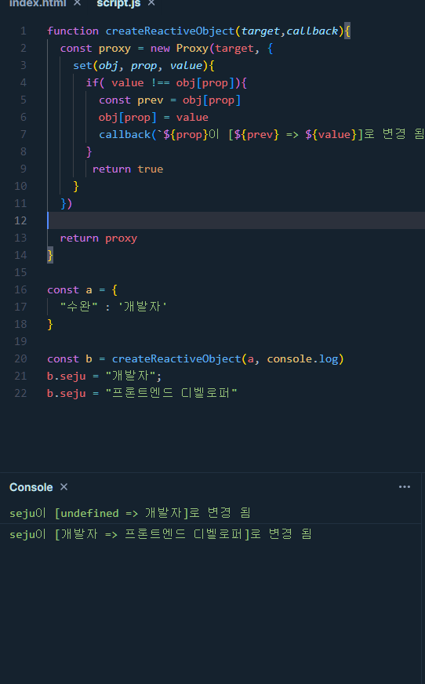

# 옵저버 패턴

## 옵저버 패턴 정의

**주체가 어떤 객체의 상태변화를 관찰 후 상태 변화 시 메서드를 통해 옵저버 목록에 있는 옵저버들에게 변화를 알려주는 디자인 패턴**

- 여기서 주체란 객체의 상태 변화를 구독하고 있는 관찰자
- 옵저버들이란 이 객체의 상태변화에 따라 전달되는 메서드 등을 기반으로 추가변화 사항이 생기는 객체를 의미

## 옵저버 패턴 구현(feat. 프록시)

### 프록시 객체

**프록시 객체란 어떠한 대상의 기본적인 동작의 작업을 가로채는 객체**

- 두개의 매개변수를 가진다.
  - target : 프록시할 대상
  - handler : target의 동작을 가로채고 어떠한 동작을 설정한것인가 설정되어 있는 함수

**프록시 객체 구현**

```js
const targetObject = {
  name: "John Doe",
  age: 30,
};

const proxy = new Proxy(targetObject, {
  // get 트랩: 속성을 읽을 때 호출됩니다.
  get: function (target, property) {
    console.log(`속성 "${property}"을 읽습니다.`);
    return Reflect.get(target, property);
  },
  // set 트랩: 속성을 설정할 때 호출됩니다.
  set: function (target, property, value) {
    console.log(`속성 "${property}"을 "${value}"로 설정합니다.`);
    return Reflect.set(target, property, value);
  },
});

// 프록시 객체를 통해 속성 읽기
console.log(proxy.name); // "속성 "name"을 읽습니다." 출력
// "John Doe" 출력

// 프록시 객체를 통해 속성 설정
proxy.age = 31; // "속성 "age"을 "31"로 설정합니다." 출력

// 원본 객체의 속성 값 확인
console.log(targetObject.age); // 31 출력
```

### 프록시 객체를 통한 옵저버 패턴 구현

- 프록시 객체의 get 함수는 속성과 함수에 대한 접근을 가로채며, set함수는 속성에 대한 접근을 가로챈다.
- set 함수를 통해 속성에 대한 접근을 가로채 객체의 상태변화를 감지할 수 있게된다.

```js
function createReactiveObject(target, callback) {
  const proxy = new Proxy(target, {
    set(obj, prop, value) {
      if (value !== obj[prop]) {
        const prev = obj[prop];
        obj[prop] = value;
        callback(`${prop}이 [${prev} => ${value}]로 변경 됨`);
      }
      return true;
    },
  });

  return proxy;
}

const a = {
  수완: "개발자",
};

const b = createReactiveObject(a, console.log);
b.seju = "개발자";
b.seju = "프론트엔드 디벨로퍼"``;
```


