# CSS Position에서 top,right,left,bottom 완벽 이해하기

> CSS position absolute로 요소를 옮길 경우 가끔 헷갈려서 정리해봅니다..😵‍💫


## 기본값

CSS에서 부모 container에 `relative`를 부여하고 <br/>
자식에 `absolute`만들 부여하면 요소는 기본적으로 <br />
**컨테이너 기준 좌측 상단**에 위치하게 된다

  <p>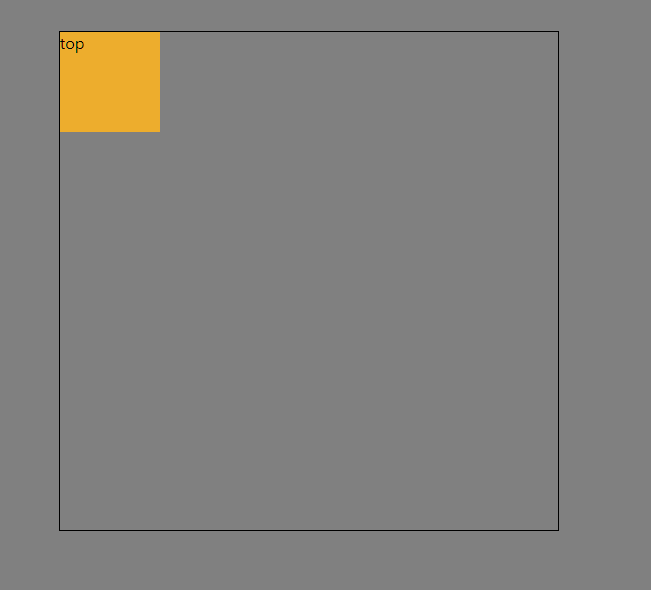</p>


## 1. ⬆️ top

### 1.2 top이 양수 일경우

- `top`에 **양수**의 값을 줄 경우 요소를 **아래로 이동**시킨다
  
```css
    .itemWrapper {
        margin-top: 50px;
        width: 500px;
        height: 500px;
        border: 1px solid;
        position: relative;
    }

    .item {
        position: absolute;
        background: #EDAD2D;
        width: 100px;
        height: 100px;
        top: 10px;
}
```

<br />


  <p>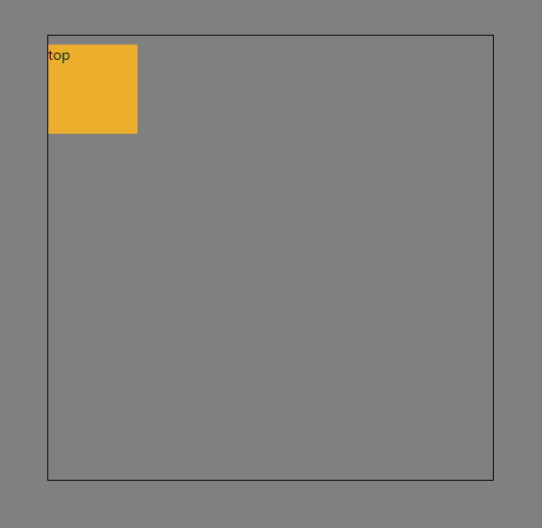</p>

### 1.3 top이 음수 일경우

- `top`이 **음수**의 값을 줄 경우 요소를 **위로**이동 시킨다

```css
    .itemWrapper {
        margin-top: 50px;
        width: 500px;
        height: 500px;
        border: 1px solid;
        position: relative;
    }

    .item {
        position: absolute;
        background: #EDAD2D;
        width: 100px;
        height: 100px;
        top: -20px;
}
```

  <p>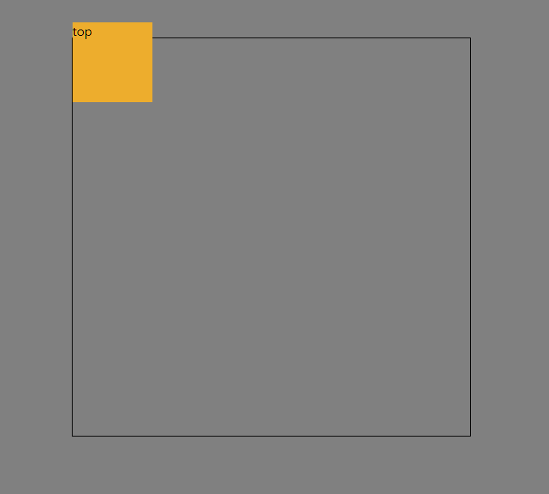</p>

<br />
<hr />
<br />


## 2. ⬇️ bottom

  하위 아이템 요소에 `bottom`값만을 부여했다면 <br />
  요소는 기본적으로 **좌측 하단**에 배치된다

### 2.1 bottom이 양수 일 경우

- `bottom`을 **양수의 값**으로 부여했다면, 좌측 하단 기준으로 **위로 이동**한다

<br />


```css
.itemWrapper {
    margin-top: 50px;
    width: 500px;
    height: 500px;
    border: 1px solid;
    position: relative;
}

.item {
    position: absolute;
    background: #EDAD2D;
    width: 100px;
    height: 100px;
    bottom: 20px;
}
```
<br />


  <p></p>

<br />


### 2.2 bottom이 음수 일 경우

- `bottom`을 **음수의 값**으로 부여했다면 요소는 좌측 하단 기준으로 **아래로** 이동한다

```css
.itemWrapper {
    margin-top: 50px;
    width: 500px;
    height: 500px;
    border: 1px solid;
    position: relative;
}

.item {
    position: absolute;
    background: #EDAD2D;
    width: 100px;
    height: 100px;
    left: 40px;
}
```

<br />

  <p>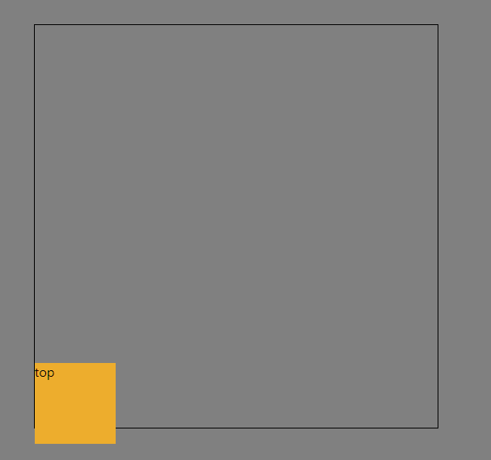</p>

<br />
<hr />
<br />


## 3. ⬅️ Left

  하위 아이템 요소에 `left`값만을 부여했다면 <br />
  요소는 기본적으로 **좌측 상단**에 배치된다

  <p>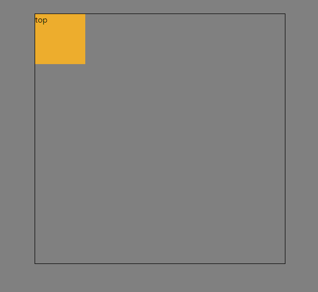</p>

### 3.1 left가 양수 일 경우

- `left`를 **양수의 값**으로 부여했다면 
- 요소는 좌측 상단 기준으로 **우측**으로 이동한다

<br />


```css
.itemWrapper {
    margin-top: 50px;
    width: 500px;
    height: 500px;
    border: 1px solid;
    position: relative;
}

.item {
    position: absolute;
    background: #EDAD2D;
    width: 100px;
    height: 100px;
    left: 40px;
}
```

<br />


  <p>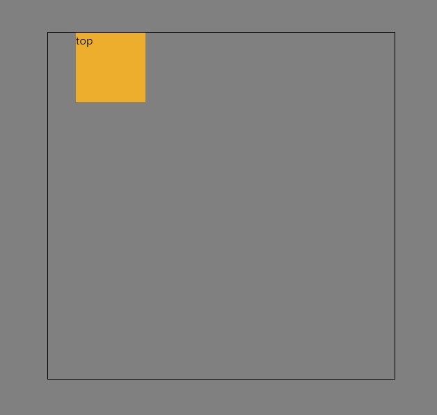</p>

<br />


### 3.2 left가 음수 일 경우

- `left`를 **음수의 값**으로 부여했다면 
- 요소는 좌측 상단 기준으로 **좌측**으로 이동한다

```css
.itemWrapper {
    margin-top: 50px;
    width: 500px;
    height: 500px;
    border: 1px solid;
    position: relative;
}

.item {
    position: absolute;
    background: #EDAD2D;
    width: 100px;
    height: 100px;
    left: -40px;
}
```

<br />


  <p>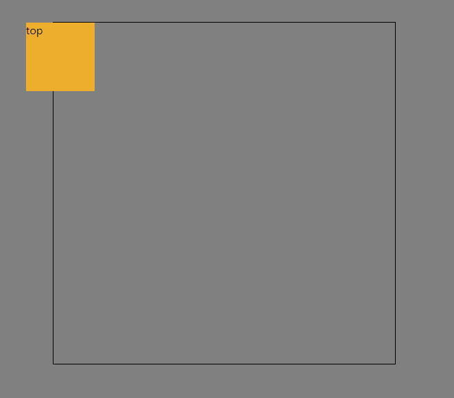</p>

<br />
<hr />
<br />


## 4. ⬅️ right

 하위 아이템 요소에 `right`값만을 부여했다면 <br />
  요소는 기본적으로 **우측 상단**에 배치된다

  <p>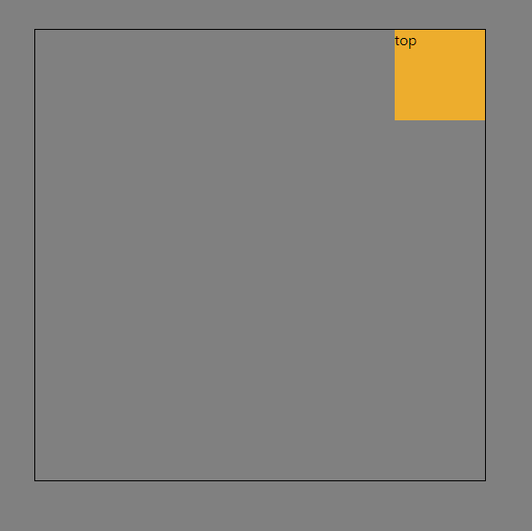</p>


### 4.2 `right`가 양수 일 경우

- `right`를 **양수의 값**으로 부여했다면 
- 요소는 좌측 상단 기준으로 **좌측**으로 이동한다

<br />


```css
.itemWrapper {
    margin-top: 50px;
    width: 500px;
    height: 500px;
    border: 1px solid;
    position: relative;
}

.item {
    position: absolute;
    background: #EDAD2D;
    width: 100px;
    height: 100px;
    right: 40px;
}
```

<br />


  <p></p>

<br />


### 4.3 `right`가 음수 일 경우

- `right`를 **음수의 값**으로 부여했다면 
- 요소는 좌측 상단 기준에서 **우측**으로 이동한다

<br />


```css
.itemWrapper {
    margin-top: 50px;
    width: 500px;
    height: 500px;
    border: 1px solid;
    position: relative;
}

.item {
    position: absolute;
    background: #EDAD2D;
    width: 100px;
    height: 100px;
    right: -40px;
}
```

<br />

  <p>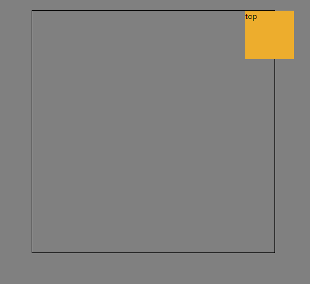</p>


<br />
<hr />
<br />

## 5. `position top:50%` `transform : translateY(-50%)`가 컨테이너 기준 가운데 수직정렬인이유

- 먼저 하위 아이템요소에 `top : 50%`만 부여했을때 요소의 모습을 살펴보면?🤔

```css
.item {
    position: absolute;
    background: #EDAD2D;
    width: 100px;
    height: 100px;
    top: 50%;
}
```
<br />


  <p>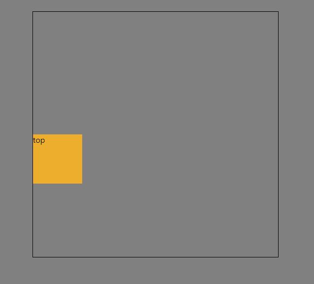</p>


> **왜 컨테이너 중앙에 배치되지않고 조금 더 아래에 배치될까?**

이유는 postion : top,bottom,left,right 속성은 <br />
요소의 상단경계를 부모 요소의 **상단경계를 기준으로 얼마나  <br />떨어뜨릴지 지정**하는 속성이기 때문이다.

<br />

  <p>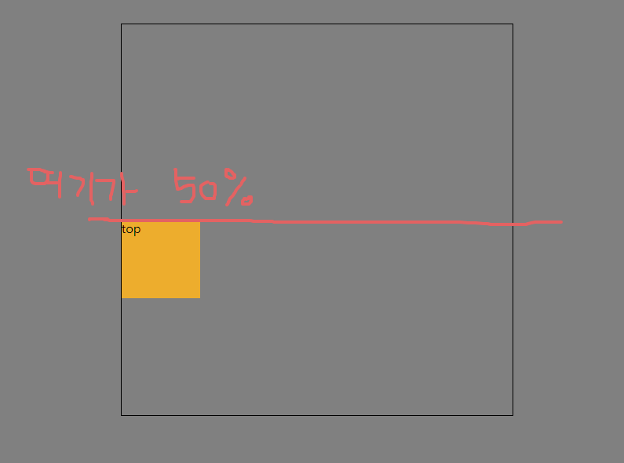</p>

따라서 요소에 top 50%만 지정하게 된다면 <br />
요소가 **부모컨테이너 경계선 기준 50%의 아래 경계선**으로 떨어진다

> **그럼 `transform : translate` 속성은?**

- `transform : trnslate` 속성은 요소에 값에 %를 부여하게 된다면 해당요소 자신의 크기 및 높이 기준으로<br >수평,수직으로 이동시키는 것으로 
- **양수값**을 주면 **아래 방향**으로
- **음수 값**을 주면 **윗 방향**으로 이동하게 된다

```css
.item {
    position: absolute;
    background: #EDAD2D;
    width: 100px;
    height: 100px;
    top: 50%;
    transform: translateY(-50%);
}
```

따라서 해당 코드에서 `transform: translateY(-50%)`를 적용한다면, <br >
translate속성이 %를 부여하면
<br > 아이템의 크기만큼 이동하는 것이므로 <br >
아이템의 크기의 `-50%` (`즉, 여기선 50px와 같다`)만큼 위쪽으로 이동하는 것이다

  <p></p>
