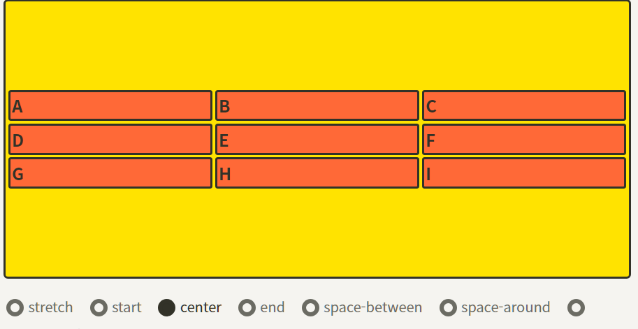

# display : grid

> grid의 정의✍️

- gird는 flex와 달리 두 방향(가로 및 세로)로 이루어진 2차원 레이아웃이다


## ✅ 1. gird-container의 속성

## ✅ 1.1 그리드 형태 정의
`grid-template-rows`
`grid-template-columns`

- 컨테이너의 grid 트랙의 크기들을 지정하는 속성
  - 여러가지 단위를 사용할 수 있으며, 섞어서도 사용가능하다
  
  ```css
    .container {
        grid-template-columns: 200px 200px 500px;
        /* grid-template-columns: 1fr 1fr 1fr */
        /* grid-template-columns: repeat(3, 1fr) */
        /* grid-template-columns: 200px 1fr */
        /* grid-template-columns: 100px 200px auto */

        grid-template-rows: 200px 200px 500px;
        /* grid-template-rows: 1fr 1fr 1fr */
        /* grid-template-rows: repeat(3, 1fr) */
        /* grid-template-rows: 200px 1fr */
        /* grid-template-rows: 100px 200px auto */
    }
  ```

- `grid-template-rows`는 행(row)의 배치
- `grid-template-columns`는 열(column)의 배치

### ✅ 1.1.1 fr?🤔

- 비율대로 트랙의 크기를 나눌 수 있음
- 1fr 1fr 1fr => **column의 비율을 1:1:1로 하겠다는 의미**
- `grid-template-columns: 100px 2fr 1fr;`
    - 왼쪽 첫번째 column의 크기는 100px로 고정되고 나머지 비율은 `2:1의 column 비율`로 유연하게 움직이게 됨

### ✅ 1.1.2 repeat()?🤔

- 반복되는 값을 자동으로 처리할 수 있는 함수
- `repeat(반복횟수, 반복값)`
    - `grid-template-columns : repeat(12,1f)` => 12개의 coulmn을 정확한 비율로 12개로 나눔


## ✅ 1.2 간격 만들기

- `row-gap`
- `column-gap`
- `gap`
  - 그리드 셀 사이의 간격을 설정한다

```css
.container {
	row-gap: 10px;
	/* row의 간격을 10px로 */
	column-gap: 20px;
	/* column의 간격을 20px로 */
}
```

## ✅ 1.3 영역 이름으로 그리드 정의

- 각 영역(`grid-area`)에 네이밍 한 후
- 그 이름을 이용하여 배치
  
<p></p>

```css
.container {
	grid-template-areas:
		"header header header"
		"   a    main    b   "
		"   .     .      .   "
		"footer footer footer";
}
```

- 그럼 각 영역의 이름들은 어떻게 매치할까?🤔
  - **해당 아이템** 요소에 `grid-area` 속성으로 이름을 지정한다
  - `.header { grid-area: header; }`


## ✅ 1.4 컨테이너 정렬

### ✅ 1.4.1 컨테이너 세로 방향 정렬

- 자식 grid-item들을 세로(column)방향으로 정렬한다
- 
```css
.container {
	align-items: stretch; //기본값
	/* align-items: start; */
	/* align-items: center; */
	/* align-items: end; */
}
```

### ✅ 1.4.2 컨테이너 가로 방향 정렬

- 아이템들을 가로(row축) 방향으로 정렬한다
  
```css
.container {
	justify-items: stretch; //기본값
	/* justify-items: start; */
	/* justify-items: center; */
	/* justify-items: end; */
}
```

### ✅ 1.4.3 컨테이너 정렬 단축속성

- `align-items`와 `justify-items`를 같이 쓸 수 있는 **단축 속성**
- `align-items` => `justify-items` 순서
  
  ```css
    .container {
        place-items: center start;
    }
  ```

## ✅ 1.5 컨테이너 아이템 그룹 정렬

## ✅ 1.5.1 컨테이너 아이템 그룹 세로정렬
- grid 아이템들이 높이를 모두 합합 값이 grid 컨테이너의 높이보다 작을 때 
-  **gird 아이템을 전부 정렬**

```css
.container {
	align-content: stretch;
	/* align-content: start; */
	/* align-content: center; */
	/* align-content: end; */
	/* align-content: space-between; */
	/* align-content: space-around; */
	/* align-content: space-evenly; */
}
```

- `align-content`: center를 지정했을때

<p></p>


<br />
<hr />
<br />


## ✅ 2. gird-item의 속성

### ✅ 2.1 각셀의 영역지정

- `grid-column-start`
- `grid-column-end`
- `grid-column`
- `grid-row-start`
- `grid-row-end`
- `grid-row`

<p></p>

- `grid-column-start`가 시작 번호, `grid-column-end`가 끝 번호
  
### ✅ 2.1.1 단축속성

- 해당 컬럼 및 로우의 start와 end를 `grid-area`로 한번에 정의 가능하다
- 순서는 `row-start => column-start => row-end => column-end` 이 순서로 정해진다

        ```css

        .item {
            grid-area : 1/2/3/4  => row-start => column-start => row-end => column-end
        }

        ```
### ✅ 2.2 개별 아이템 정렬

### ✅ 2.2.1 개별 아이템 세로 정렬

- 해당 아이템을 세로(column축) 방향으로 정렬

```css
item {
	align-self: stretch;
	/* align-self: start; */
	/* align-self: center; */
	/* align-self: end; */
}
```

### ✅ 2.2.1 개별 아이템 가로 정렬

- 해당 아이템을 가로(row축) 방향으로 정렬

```css
.item {
	justify-self: stretch;
	/* justify-self: start; */
	/* justify-self: center; */
	/* justify-self: end; */
}
```

### ✅ 2.2.1 개별 아이템 단축속성

- `place-self`
- `align-self` => `jusify-self` 순서로 작성

```css
.item {
	place-self: start center;
}
```