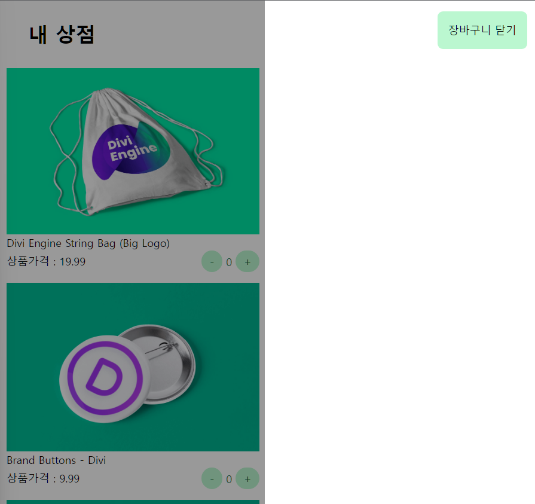

# CSS로 Layer 구현하기

## 어떻게 구현할까?

- 먼저 하나의 가장 큰 레이어가 뷰포트 전체를 꽉채운다는 생각으로 시작
  - 그리고 해당 엘리먼트 내부 레이어가 두개 존재하게 되는데 각각의 레이어는 실제화면에 랜더링 될 레이어, 화면 외부에 렌더링 될 레이어로 구분된다
- 레이어 외부 가장 큰 레이아웃 컨테이너에 `position`을 `relative`를 부여
  - 가장 큰 레이어는 `postion:fixed` 부여 후 `inset-9`, 즉, `top-0`, `left-0`, `bottom-0`, `right-0`을 부여 해 꽉차게 만든다.
  - 내부 레이어는 `width`를 이용해 자유롭게 나눌 수 있게되며 외부 레이어 `left`와 `right`로 구별되며, 바깥 레이어는 `opacity`를 부여함으로 써 투명하게 구성한다

```html
<!-- 장바구니 버튼 클릭 시 보여질 레이어 -->
<div class="cart-layer fixed inset-0">
  <!-- 레이어 외부 -->
  <div
    class="cart-layer__outside fixed top-0 left-0 bottom-0 w-1/2 bg-black opacity-25"></div>

  <!-- 장바구니 클릭 시 실제 보여질 레이어 -->
  <div
    class="cart-layer__dimmed fixed top-0 right-0 bottom-0 w-1/2 bg-white p-4">
    <div class="flex justify-end">
      <button class="btn-close bg-green-200 rounded-lg p-4">
        장바구니 닫기
      </button>
    </div>

    <!-- 장바구니 레이어 내부에 들어갈 아이템들 -->
    <div class="cart-layer__items"></div>
  </div>
</div>
```

### 구현된 레이어


