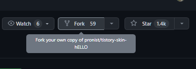
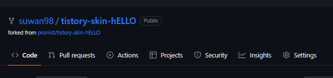
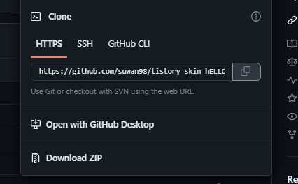

# Fork

> ## Fork란? ✍️

`fork`는 **다른 사람의 github Repository**에서 내가 어떤 부분을 수정 및 추가 기능을 넣고 싶을 때

**해당 Github Repository**를 **내 Repository**로 그대로 복제하는 기능이다

`fork`한 저장소는 원본(다른 사람의 원격저장소)로 연결 되어 있다.

여기서 연결 되어 있다는 의미는 **original repository**에 어떠한 변화가 생기면(`새로운 commit`) 

이는 그대로 `forked`된 repository로 **반영**할 수 있다 <br/>
즉, `fork`는 **다른 계정의 원격 저장소를 내 계정**으로 가지고 올 때 사용한다

이 때 `fetch` 나 `rebase`의 과정이 필요하다

<hr />

<br />

> ## Fork 하는 방법 ✍️


<br />

1. 복사하고자 하는 Github 레퍼지토리에 들어가 오른쪽 상단에 Fork를 클릭한다


    

    `fork`가 완료 되면 내 레퍼지토리에 내 레퍼지토리에 생성된다
    
    

2. 이제 포크한 저장소를 `clone`하기 위해 주소 복사 버튼을 누른다

   <br />

    


    <br />
3. 저장하고자 하는 곳으로 이동 후 `clone` 한다
   
   ```bash
    $ cd "저장하고자 하는 디렉토리"
    $ git clone "복사한 git 주소"
    ```

    <br />

4. 원격 저장소의 이름들을 가지고 온다
   
   `$ git remote`

    <br />
 
5. 새로운 원격 저장소를 추가한다
   
   `$ git remote add "새로운 원격저장소 이름" "fork 한 git 주소"`

   <br />

6. `fetch`를 해 로컬 저장소에는 없지만 원본 저장소에 있는 데이터를 가져온다


    `$ git fetch "새로운 원격저장소 이름"`