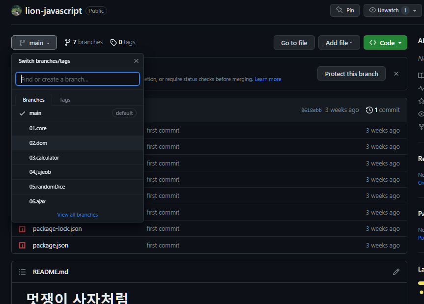
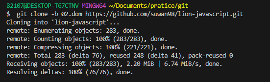
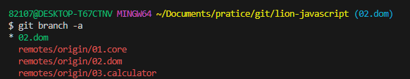
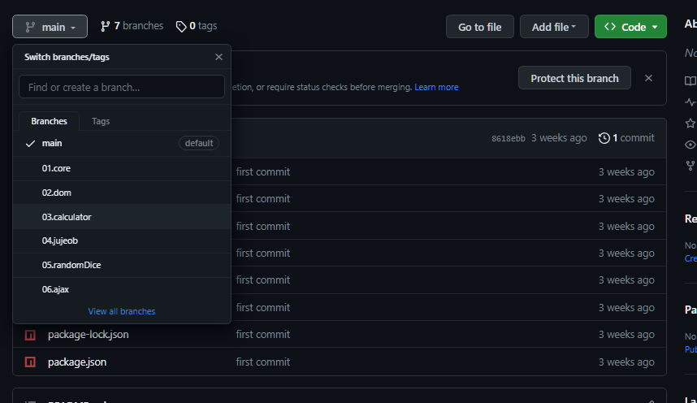
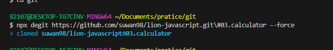
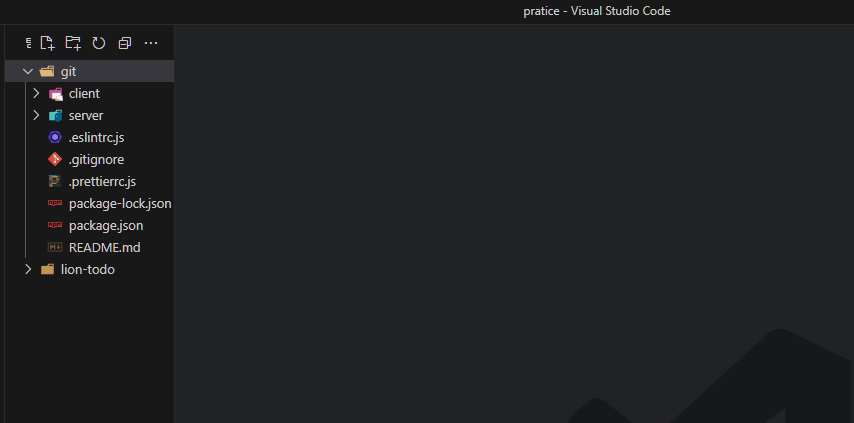

# git clone brach & degit으로 특정브랜치만 가져오기

## git clone으로 특정브랜치만 가져오기

- 내 `remote repository`의 `02.dom branch`만을 `clone` 해보자.



<span style="color:gray">_내가 복사할 branch_ </span>

- 복사해보기

```bash
$ git clone -b "복사할 브랜치 명" "복사할 remope 저장소 주소"
```



<span style="color:gray">`git clone -b 02.dom https://github.com/suwan98/lion-javascript.git` </span>



<span style="color:gray">_복사완료_ </span>


<br />
<hr />
<br />

## degit으로 특정 브랜치만 클론해오기

- 이번엔 세번째 브랜치를 `degit`으로 클론해보자



<span style="color:gray">_03.calculator를 복제해보자_ </span>

```bash
$ npx degit "내가 복사할 레포지토리 주소"\브랜치명
```



<span> _$ npx degit https://github.com/suwan98/lion-javascript.git\#03.calculator --force_</span>



<span style="color:gray">_복사 성공!😀_ </span>

- 그러나 `degit`으로 `clone`할때는 git `clone`과는 다르게 브랜치 조회되지않으니 주의해서 사용할것!