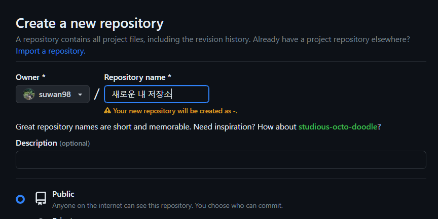
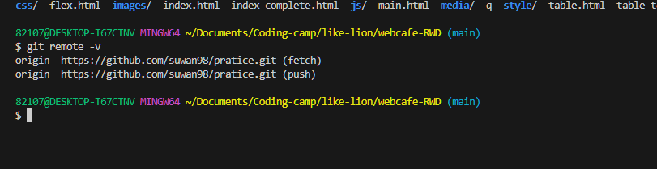
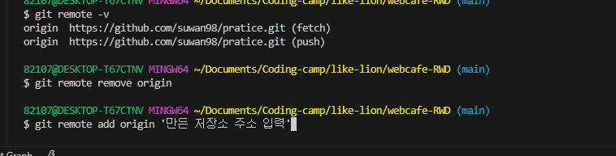
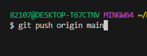

## 내가 가져왔던 폴더에 상대방의 원격저장소가 이미 존재한다면?

 

**목표** : 내 원격저장소를 따로 만든 후  =>  
기존에 가져왔던 폴더의 원격저장소와의 관계를 끊고 내 새로운 저장소에 push

 

### 1. github에서 새 원격저장소 만들기

### 2. 현재 내 원격저장소 확인

### 3. 기존 폴더에서 `add` 나 `commit`이 안되어 있으면 둘다 해놓은 후

 
 

### 4. 현재 원격저장소 삭제 후 새로운 저장소 추가

 

`git remote remove origin`   
`git remote add  origin '새로 추가할 저장소 주소'`

 
 

### 5. git push origin maim 이나 master로 push

 

이렇게하면 기존 원격 저장소와의 원격 저장소가 끊어지고 내 저장소와 연결됩니다