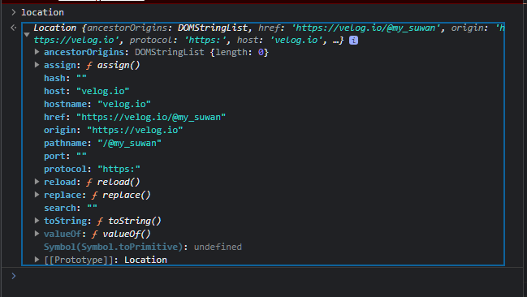

# 브라우저 객체 모델 (BOM)

> 🚀 BOM 정의
- javascript를 사용하면 브라우저의 정보에 접근하거나, 브라우저의 여러기능을 제어할 수 있다
- javascript에서는 이런 BOM 객체모델을 전역 객체로 사용할 수 있다


## ✅ Browser 객체 종류
<hr />


|window|document|history|location|screen|navigator|
|---|---|---|---|---|---|
|모든 객체가 소속된 객체이며 브라우저 창을 의미|현재 문서에 대한 정보를 담고 있는 객체|현재 브라우저가 접근했던 URL history를 제어|문서의 주소와 관련된 객체 window 객체의 프로퍼티인 동시에 documnet의 프로퍼티|사용자 디스플레이 화면에 관한 정보를 갖고 있는 객체|실행중인 브라우저에 대한 정보를 알 수 있는 객체|

## ✅ Window 
<hr />


- 웹 브라우저의 창(window)를 나타내는 객체
- Javascript에서 모든 객체, 전역함수, 전역 변수들은 자동적으로 window 객체의 프로퍼티가 된다
- window 객체의 메서드는 **전역함수이며**, window 객체의 프로퍼티는 **전역 변수**가 된다
- **DOM의 요소들도 모두 window 객체의 프로퍼티**
- **즉, window는 모든 객체의 조상**이다


### ✅ Window 객체 구조
<hr />


<br />


## ✅ History 
<hr />

```js
// 다음 페이지로 가기
const goForward = () => {
    window.history.forward();
}

// 이전 페이지로 가기
const goBack = () => {
    window.history.back();
}
```

<br />


## ✅ Location 
<hr />




- 현재 브라우제 표시된 HTML 문서의 주소를 얻거나
- 새 문서를 불러올 때 사용
- location 객체의 프로퍼티와 메소드를 활용하면 현재 문서의 URL 주소를 다양하게 해석하여 처리할 수 있어진다

<br />

## ✅ Screen 
<hr />

- 사용자의 디스플레이 화면에 대한 다양한 정보를 저장하는 객체


<br />

## ✅ Navigator
<hr />

- 브라우저 공급자 및 버전 정보 등을 포함한 브러우저에 대한 다양한 정보를 저장하는 객체

