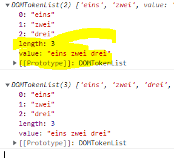

# DOMTokenList 유사배열 객체

## DOMTokenList 정의

**`class` 어트리뷰트의 정보를 나타내는 컬렉션 객체**

- `classList` 프로퍼티를 참조할 때 반환되는 객체이다
- 유사배열 객체이면서 이터러블이다
- `DOMTokenList`는 다음과 같은 메서드를 제공한다.
- 자바스크립트 배열 객체와 마찬가지로 0으로 시작되며 인덱싱된다
- `DOMTokenList`는 항상 대소문자를 구별한다

```js
<style>
	.box {width : 100px; height : 100px};
	.red {color :red};
	.blue {color : blue};
</style>

<div class="box red">Hellow</div>

/* script */

const box = document.querySelector('.box');

/* .box 요소의 class 어트리뷰트 정보를 담은 DOMTokenList 객체 취득*/
/* 노드 객체의 상태변화를 실시간으로 반영하는 살아있는 객체 */
/* DOMTokenList(2) [length : 2, value : 'box blue', 0 : 'box' , 1: 'red' */
console.log(box.classList)
```

<br />



<br />

## DOMTokenList객체에 사용가능 한 메서드

### add(className)

**`add`메서드는 인수로 전달한 1개 이상의 문자열을 `class` 어트리뷰트의 값으로 추가한다.**

```tsx
box.classList.add("foo");
box.classList.add("bar", "baz"); // class ="box red foo bar baz"
```

### remove(className)

- 인수로 전달한 1개이상의 문자열과 일치하는 클래스를 `class` 어트리뷰트에서 삭제
  - 인수로 전달한 문자열과 일치하는 클래스가 `class` 어트리뷰트에 없을 시 에러 없이 무시

```tsx
box.classList.remove('foo') -> // class='box red bar baz'
```

**item(index)**

- 인수로 전달한 `index`에 해당하는 클래스를 `class` 어트리뷰트에서 반환

```tsx
box.classList.item(0); // 'box'
box.classList.item(1); // 'red'
```

**contains(className)**

- 인수로 전달한 문자열과 일치하는지의 유무를 불리언으로 반환

```tsx
box.classList.contains("box"); // true
box.classList.containts("asdfas"); // false
```

**replace(oldClassName, newClassName)**

- 인수로 첫번째 전달한 문자열을 두번째 인수로 전달한 문자열로 교체

```tsx
box.classList.replace("red", "blue"); // -> class="box blue"
```

**toggle**

- `class` 어트리뷰트에 인수로 전달한 문자열과 일치하는 클래스가 존재하면 제거, 존재하지 않으면 추가

```tsx
box.classList.toggle("손흥민"); // -> class="box blux 손흥민"
box.classList.toggle("손흥민"); // -> class="box blux"
```
