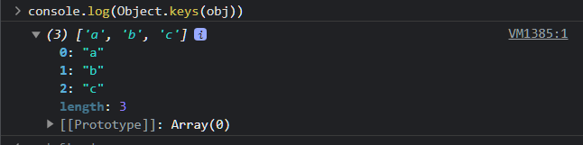

# 객체 메서드 Object.keys()

## Object.keys()란?

- 객체의 `key` 값들만을 받아서 **새로운 배열**로 반환 (원본 객체에는 영향 ❌)

## Object.keys() 사용하기

- 먼저 아래와 같은 객체가 있다고 가정할때,

```js
const obj = {a:"some", b:"h1", c:"ello"}
```

- 해당 객체를 `Object.keys()`로 키값들을 새로운 배열로 반환해보자
- 해당 `obj`객체의 `key`값들만 모여서 새로운 배열로 반환되었다

```js

const newArray = Object.keys(obj)
console.log(newArray)

```
