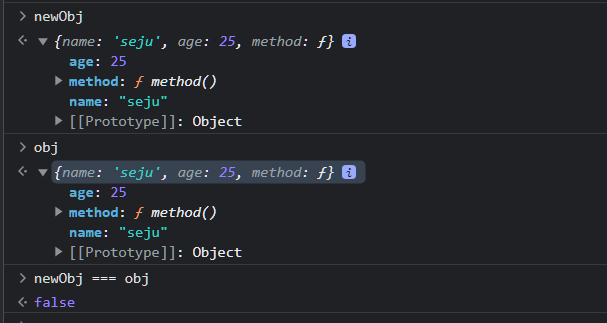

# Object.assign

- 얕은복사 방법 중 하나
- 원본 객체를 복사해 하나의 새로운 객체로 반환한다.

```js
const obj = {
    name : 'seju',
    age : 25,
    method(){
        return `안녕하세요? 제 이름은 ${this.name}입니다!`
    }
}

const newObj = Object.assign({},obj);

```

- `Object.assign`에선 첫번째 매개변수로 target, 즉 source의 프로퍼티들을 복사해**반영한 후 반환할 객체**이다.
  두번째 매개변수는 `source`, **내가 복사할 객체**를 선택한다.



<span style="color:gray">_객체를 복사했지만 비교하면 false가 나온다 왜냐하면 값만 복사하는것이지 메모리 주소를 같이 공유하는것이 아니기 때문에(얕은복사)_</span>