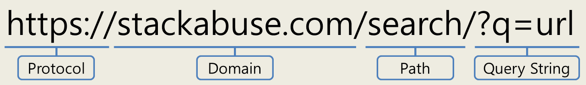

# URLSearchParams

## URLSearchParams 정의

**Query String**

- 웹사이트의 `URL`에서 `?`로 시작하는 문자열

<br />
  
<br />

- `URL`의 `Query String`을 추출 후 원하는 정보를 가져와야할 경우가 생긴다
- 복잡한 `Query String`을 손쉽게 파싱할 수 있도록 `URLSearchParams`객체가 제공된다.

## URLSearchParams 객체 생성

**URLSearchParams 객체 생성 방법에는 3가지가 존재**

### URLSearchParams 객체 생성방법 1번째

**URL 객체 생성 후 search 프로퍼티를 URLSeacrhParams 생성자 함수에 인자로 전달**

```js
const urlObject = new URL("http://localhost300");
const urlSeacrObject = new URLSeacrParams(urlObject.search);
```

### URLSearchParams 객체 생성방법 2번째

**`URLSeacrParams` 생성자 함수에 인자로 `Query String` 전달**

- 이때 물음표(`?`)는 포함하거나 생략할 수 있다.

```js
const urlSearchObj1 = new URLSearchParams("?q=url&type=article");
const urlSearchObj2 = new URLSearchParams("q=url&type=article");
```

### URLSearchParams 객체 생성방법 3번째

**Key-Value 쌍을 배열 또는 객체 형태로 전달**

```js
// entry를 배열 형태로 전달
const urlSearchObj1 = new URLSearchParams([
  ["q", "url"],
  ["type", "article"],
]);

// entry를 객체 형태로 전달
const urlSearchObj2 = new URLSearchParams({q: "url", type: "article"});
```

## URLSearchParams 객체의 메서드

### paramsObject.append() : 쿼리스트링 파라미터 추가 메서드

**해당 메서드를 통해 쿼리 파라미터를 하나씩 추가할 수 있다**

```js
const searchParams = new URLSearchParams();
searchParams.append("mode", "dark");
searchParams.append("page", 1);
searchParams.append("draft", "false");
searchParams.append("sort", "email");
searchParams.append("sort", "date");

/*mode=dark&page=1&draft=false&sort=email&sort=date*/
searchParams.toString();
```

### paramsObject.get() : 쿼리스트링 값 가져오기

**`Quert String`의 특정 키(`key`)에 대한 값을 가져온다**

- 특정 키가 존재하지 않을시 `null`을 반환한다.

```js
const urlSearchObj = new URLSearchParams("?q=url&type=article");

console.log(urlSearchObj.get("q")); // url
console.log(urlSearchObj.get("type")); // article
console.log(urlSearchObj.get("page")); // null
```

### paramsObject.getAll() : 쿼리스트링 값 모두 가져오기

**`Query String`의 키는 여러개의 값을 가질 수 있다**

- 특정 키에 대한 값이 여러개인경우 `getAll`메서드로 쿼리스트링에 대한 모든 값을 배열로 반환받는다.

```js
const urlSearchObj = new URLSearchParams("?q=1&q=2&q=3");

console.log(urlSearchObj.get("q")); // 1
console.log(urlSearchObj.getAll("q")); // ['1', '2', '3']
```

### paramsObject.has() : 특정 파라미터 존재 여부 확인

**인수로 전달된 특정 `Query Stiring`이 존재하는지 여부를 불리언값으로 반환한다.**

```js
const urlSearchObj = new URLSearchParams("?q=1&q=2&q=3");

console.log(urlSearchObj.has("q")); // true
```

## URL과 URLSearchParams 함께 사용하기

**URL 객체의 특징**

- `URL` 객체의 `search` 프로퍼티에는 쿼리스트링이 문자열로 저장되어 있다
- `searchParams` 프로퍼티에는 쿼리스트링이 `URLSeacrParams` 객체 형태로 저장되어 있따

```js
const url = new URL("https://example.org:8080/foo/bar?q=baz#bang");
url.search; // '?q=baz'

const searchParams = url.searchParams; // URLSearchParams {size: 1}
```

**주의사항**

- `URL` 객체의 `searchParams` 프로퍼티는 `readOnly`이다
  - 따라서 `search` 프로퍼티를 통해서 `URLSeachParams` 객체를 문자열로 변환한 후 `URL`객체의 `search`속성에 할당해야한다.

```js
const url = new URL("https://example.org:8080/foo/bar?q=baz#bang");
url.search = new URLSearchParams("q=updated&r=2&r=false").toString();
url.toString(); // 'https://example.org:8080/foo/bar?q=updated&r=2&r=false#bang'
```
