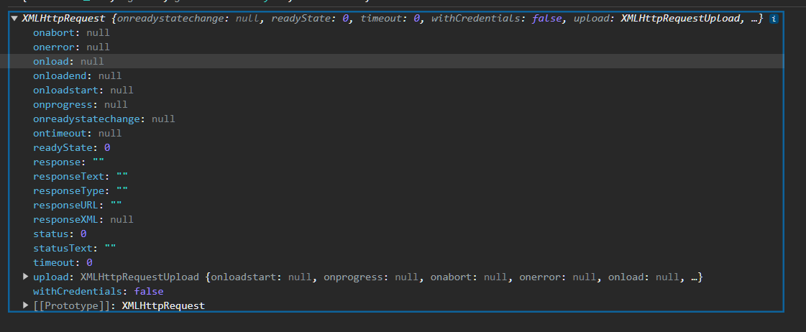
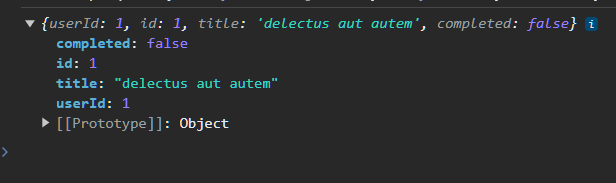

# XMLHttpRequest 객체

**XMLHttpRequest란?**

- 브라우저는 주소창이나 HTML의 `form` 태그 또는 `a` 태그를 통해 HTTP 요청 기능을 기본제공
- 자바스크립트를 사용해 HTTP 요청을 전송하려면 `XMLHttpRequest` 객체를 사용
- Web API인 `XMLHttpRequest` 객체는 HTTP 요청 전송과 HTTP 응답 수신을 위한 다양한 메서드와 프로퍼티를 제공

### XMLHttpRequest 객체 생성

**XMLHttpRequest 객체 생성 방법**

- `XMLHttpRequest` 생성자 함수의 호출을 통해 생성
- 해당 객체는 브라우저에서 제공하는 `Web API`이므로 브라우저 환경에서만 정상적으로 동작한다

```jsx
/* XMLHttpRequest 객체 생성 */
const xhr = new XMLHttpRequest();
console.log(xhr);
```



### XMLHttpRequest 객체의 프로퍼티와 메서드

**XMLHttpRequest 객체는 다양한 프로퍼티와 메서드를 제공**

> 💡 **XMLHttpRequest 객체의 프로토타입 프로퍼티**

**readyState**

- HTTP 현재 상태를 나타내는 정수
  - UNSET : 0
  - OPENEND : 1
  - HEADERS_RECEIVED : 2
  - LOADING : 3
  - DONE : 4

**status**

- HTTP 요청에 대한 응답 상태를 나타내는 정수
  - 예시
    - 200,404,500

**statusText**

- HTTP 요청에 대항 응답 메세지를 나타내는 문자열
  - 예시
    - “OK”

**responseType**

- HTTP 응답 타입
  - 예시
    - `document`, `json`, `text`, `blob`, `arraybuffer`

**response**

- HTTP 요청에 대한 응답 몸체
- `responseType`에 따라 달라진다

**responseText**

- 서버가 전송한 HTTP 요청에 대한 응답 문자열

> 💡 **XMLHttpRequest 객체의 이벤트 핸들러 프로퍼티**

**onreadystatechange**

- `readyState` 프로퍼티 값이 변경된 경우

**onloadstart**

- HTTP 요청에 대한 응답을 받기 시작한 경우

**onprogress**

- HTTP 요청에 대한 응답을 받는 도중 주기적으로 발생

**onabort**

- abort 메서드에 의해 HTTP 요청이 중단된 경우

**onerror**

- HTTP 요청에 에러가 발생한 경우

**onload**

- HTTP 요청이 성공적으로 완료한 경우

**ontimeout**

- HTTP 요청 시간이 초과한 경우

**onloadened**

- HTTP 요청이 완료한 경우
- HTTP 요청이 성공 또는 실패하면 발생

> 💡 **XMLHttpRequest 객체의 메서드**

**open**

- HTTP 요청 초기화

**send**

- HTTP 요청 전송

**abort**

- 이미 전송된 HTTP 요청 중단

**setRequestHeader**

- 특정 HTTP 요청 헤더의 값 설정

**getResponseHeader**

- 특정 HTTP 요청 헤더의 값을 문자열로 변환

### HTTP 요청 전송

**HTTP 요청 전송 시 다음 순서로 진행**

1. `XMLHttpRequest.prototype.open` 메서드로 HTTP 요청 초기화
2. 필요에 따라 `XMLHttpRequest.prototype.setRequestHeader` 메서드로 특정 HTTP 요청의 헤더 값을 설정
3. `XMLHttpRequest.prototype.send` 메서드로 HTTP 요청을 전송

```tsx
/* XMLHttpRequest 객체 생성 */
const xhr = new XMLHttpRequest();

/* HTTP 요청 전송 */
xhr.open("GET", "/users");
xhr.setRequestHeader("content-header", "application/json");
xhr.send();
```

**XMLHttpRequest.prototype.open**

- open 메서드는 서버에 전송할 HTTP 요청을 초기화한다.

```tsx
xhr.open(method, url[, async])
```

| 매개변수 | 설명                                      |
| -------- | ----------------------------------------- |
| method   | HTTP 요청메서드 (GET,POST,PUT, DELETE 등) |
| url      | HTTP 요청을 전송할 URL                    |
| async    | 비동기 요청 여부 기본값은 true            |

**HTTP 요청 메서드**

- 서버에게 요청의 종류와 목적을 알리는 방법
- 주로 5가지 요청메서드를 통해 CRUD를 구현
  - GET (데이터 획득)
  - POST (데이터 전송)
  - PUT (데이터 전체 교체)
  - PATCH (데이터 일부 수정)
  - DELETE (데이터 삭제)

**XMLHttpRequset.prototype.send**

- `open` 메서드로 초기화된 HTTP 요청을 서버에 전송
- `GET`,`POST` 요청에 따라 전송방식에 차이가 존재
  - `GET` 요청 메서드 경우 데이터를 서버에 전송
  - `POST` 요청 메서드일 경우 데이터(payload)를 요청 몸체에 담아 전송

**send로 전송시 요청 몸체에 담아 전송할 데이터를 인수로 전달할 수 있다**

- 이때 전달할 객체는 `JSON.stringfy`로 JSON으로 변환 후 전송해야한다
- 만약 HTTP 요청 메서드가 `GET`일 경우 `send` 메서드에서 페이로드로 전달한 인수는 무시되고 요청몸체는 `null`로 설정된다

```jsx
/* send로 전송시 요청 몸체에 담아 전송할 데이터를 인수로 전달할 수 있다 */
xhr.send(JSON.stringify({id: 1, content: "HTML", complted: true}));
```

**XMLHttpRequest.prototype.setRequestHeader**

- 특정 HTTP 요청의 헤더값을 설정
- setRequestHeader 메서드는 반드시 open 메서드로 초기화 한 후 호출해야 한다
- 자주 사용되는 HTTP 요청 헤더
  - Content-type
  - Accept

| MIME 타입   | 서브 타입                              |
| ----------- | -------------------------------------- |
| text        | text/plain, text/html, text/javascript |
| application | application/json                       |
| multipart   | multipart/formed-data                  |

**요청 몸체에 담아 서버로 전송할 페이이로드의 MIME 타입을 지정하는 예시**

```tsx
xhr.setRequestHeader("content-header", "application/json");
```

**HTTP 클라이언트가 서버에 요청 시 서버가 응답할 데이터의 MIME 타입을 Accept로 지정 가능**

```tsx
xhr.setRequestHeader("accept", "application/json");
```

### HTTP 응답 처리

**서버가 전송한 응답 처리 시 XMLHttpRequest 객체가 발생시키는 이벤트를 캐치해야 함**

- `XMLHttpRequest`의 이벤트 핸들러 프로퍼티 중 HTTP 요청의 현재 상태를 나타내는 `readyState` 프로퍼티 값이 변경될 경우 발생하는 `readystatechange` 이벤트를 캐치해 HTTP 응답을 처리할 수 있다

```jsx
/* 실제 HTTP 응답처리 */
const SERVER_URL = "https://jsonplaceholder.typicode.com/todos/1";
const realXhr = new XMLHttpRequest();
realXhr.open("GET", SERVER_URL);
/* HTTP 요청 전송 */
realXhr.send();

/* 해당 이벤트는 HTTP 현재 상태를 나타내는 readyState 프로퍼티가 변경 될 때마다 발생 */
realXhr.onreadystatechange = () => {
  // 만약 서버 응답이 아직 완료되지 않았다면 리턴
  if (realXhr.readyState !== XMLHttpRequest.DONE) return;

  if (realXhr.status === 200) {
    **console.log(JSON.parse(realXhr.response));**
  } else {
    console.error("Error", realXhr.status, realXhr.statusText);
  }
};
```



**readystatechange 이벤트 대신 load 이벤트를 캐치해도 무방**

- `load`이벤트는 `HTTP`요청이 성공적으로 완료된 경우 발생
  - 따라서 `load` 이벤트 캐치 시 `xhr.readyState`가 `XMLHttpRequest.DONE` 인지 확인할 필요가 없다

```jsx
const SERVER_URL = "https://jsonplaceholder.typicode.com/todos/1";
const realXhr = new XMLHttpRequest();
realXhr.open("GET", SERVER_URL);
/* HTTP 요청 전송 */
realXhr.send();

realXhr.onload = () => {
  if (realXhr.status === 200) {
    console.log(JSON.parse(realXhr.response));
  } else {
    console.log("Error");
  }
};
```
