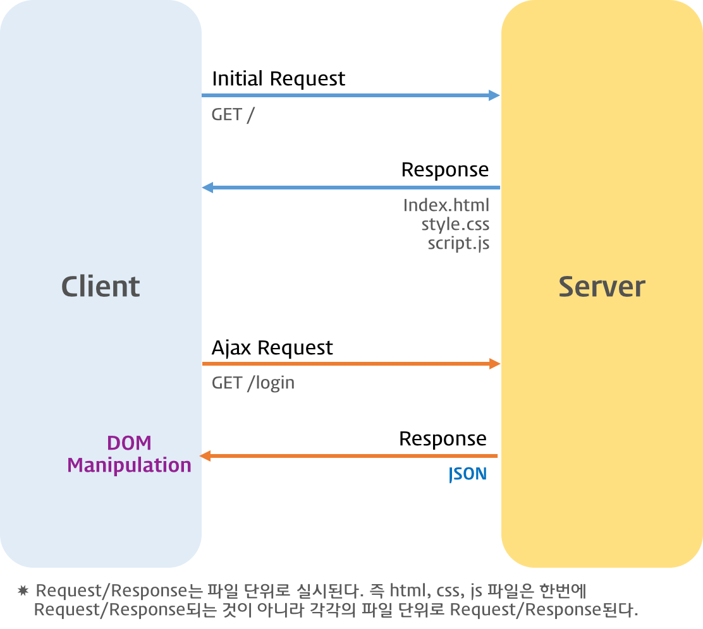

# Ajax

## Ajax란?

- 자바스크립트를 사용해 브라우저가 서버에게 비동기 방식으로 데이터를 요청하고, 서버가 응답한 데이터를 수신해 웹페이지를 동적으로 갱신하는 프로그래밍 방식
- `Ajax`는 브라우저에서 제공하는 Web API `XMLHttpRequest` 객체를 기반으로 동작
  - `XMLHttpRequest`는 HTTP 비동기 통신을 위한 메서드와 프로퍼티 제공

**기존 과거의 웹페이지의 단점은?**

1. 이전 웹페이지와 차이가 없어 변경할 필요가 없는 부분까지 포함된 완전한 HTML을 서버로부터 매번 다시 전송받으므로 불필요한 데이터 통신이 발생
2. 변경할 필요가 없는 부분까지 처음부터 다시 렌더링한다
   - 이로 인해 화면전환 시 화면이 순간적으로 깜빡이는 현상 발생
3. 클라이언트와 서버 통신이 동기방식으로 동작하므로 서버로부터 응답이 있을때까지 다음 처리는 블로킹된다

**Ajax의 등장으로부터 전통적인 패러다임은 획기적으로 전환됨**

- 서버로부터 웹페이지의 변경에 필요한 데이터만 비동기 방식으로 전송받아 웹페이지에 변경될 필요가 없는 부분들은 다시 렌더링하지않고 변경되는 부분만 한정적으로 렌디링을 처리하게 된다
- 이를 통해 브라우저에서도 데스크톱 애플리케이션과 유사한 빠른 퍼포먼스와 부드러운 화면전환이 가능해졌다

