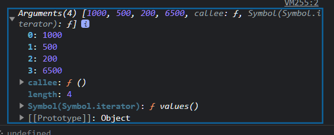

# 일반함수에서 argments와 화살표함수에서 ...args

## 일반함수에서 argments

- `argments` 객체는 함수에 **전달된 인수**에 해당하는 `Array 형태의 객체`이다
- `argments`는 **유사배열 객체**이다
- 자바스크립트에 기본적으로 내장되어 있음

```js
let calculateTotal = function () {
    //해당 arguments는 함수의 인수인 1000,500,200,6500에 해당한다
  console.log(arguments);
};

const result = calculateTotal(1000, 500, 200, 6500);
```


<span style="color:gray">_calculateTotal()의 arguments 객체_</span>

- `argments`객체를 활용하면, 사용자가 인수를 추가할때마다, 파라미터를 일일히 그에 맞춰서 추가할 필요가 없어진다.
- 아래 코드는 `total`값을 0으로 할당하고, `params`라는 변수에 `arguments` 객체를 `spread`연산자로 각각 전개시켰다.
- 그리고 전개시킨 `params` 배열에 순환을 돌아 해당 인수들 마다 total 값을 더해줬다

```js
let calculateTotal = function () {
  let total = 0;
  let params = [...arguments];
  params.forEach((item) => {
    total += item;
  });

  return total;
};

const result = calculateTotal(1000, 500, 200, 6500);
console.log(result); //8200

```

**그러나** 화살표함수에서는 `arguments`라는 객체자체가 존재하지 않는다 어떻게 해야할까?

<br />

## 화살표함수에서 rest parmeter

- 화살표함수에서도 arguments 객체와 같은 역할을 하는 **매개변수**가 존재
- `...args`
  - `rest parmeter`라고 한다
  - 화살표 함수에서 매개변수에 (...args)를 작성하면, 함수로 전달되었을때 인수들을 **나머지**를 받을 수 있음 (전부도 OK)

```js
let calcAllMoney = (...args) => {
  let total = 0;
  args.forEach((item) => {
    total += item;
  });

  return total;
};

let result = calcAllMoney(1000, 500, 200, 2000); // 3700
```

- `rest-parmeter`는 일반함수와 달리 바로 전개되어서 받을 수 있으므로 일반함수처럼 `Array.from()`이나 `spread` 연산자로 전개 시킬 필요가 없어진다

- 말그대로 **나머지 매개변수이기 때문에** 인수들을 제외한 나머지를 `rest-parmeter`로 받을 수도 있다

```js
let calcAllMoney = (a, b, ...args) => {
  return args.reduce((acc, item) => acc + item, 0);
};

//restparmeter로 a,b를 제외한 나머지 값들을 받을 수 있음(200,2000)
let result = calcAllMoney(1000, 500, 200, 2000);
```