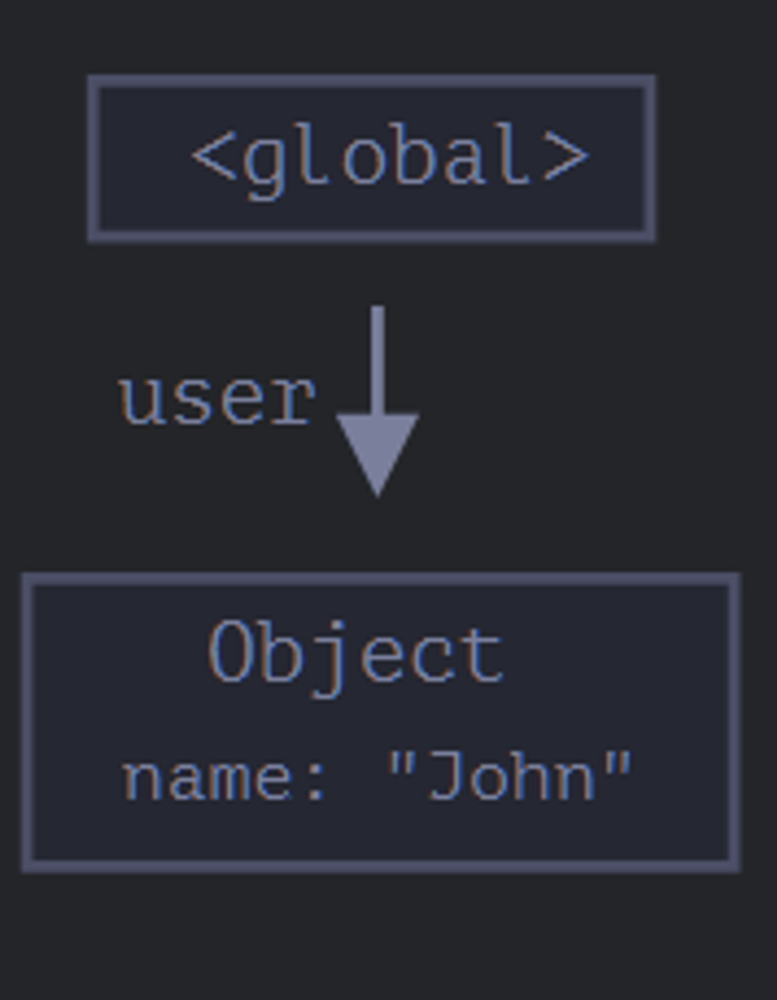
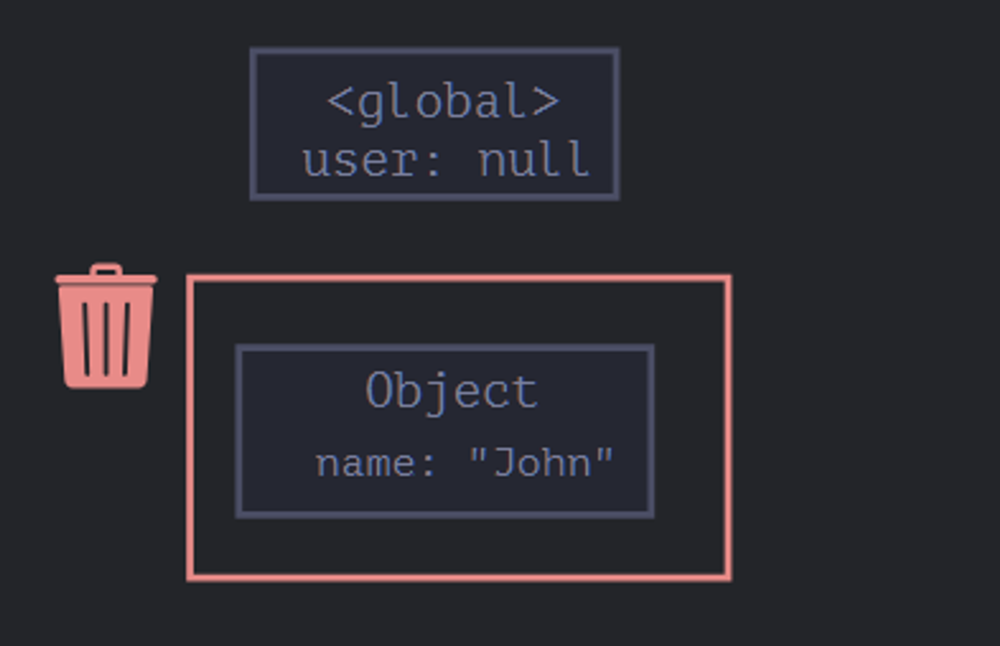
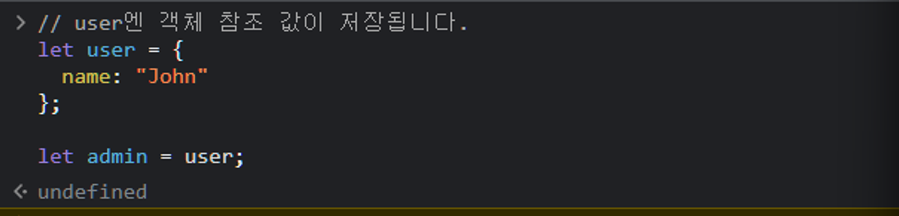
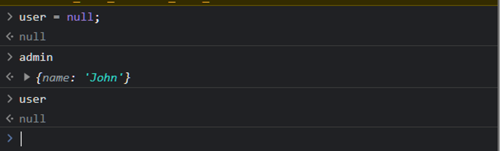

# 가비지 컬렉션

## 가비지 컬렉션이란??

**자바스크립트는 눈에서 보이지 않는 곳에서 메모리 관리를 수행 한다**

- 각자 가지고 있는 메모리 공간이 따로 존재한다
- 여기서 더는 쓸모 없어지게 된 메모리들을 어떻게 처리할까?

<br />

### 가비지 컬렉션의 기준

**도달 가능성이라는 개념을 사용해 메모리 관리를 수행**

- 도달가능성이란?
  - 어떻게든 접근하거나 사용할 수 있는 값. 도달 가능한 값들은 메모리에서 삭제 ❌

> 아래 값들은 태생부터 도달 가능하기 때문에 명백한 이유없이는 삭제 ❌

- 해당값들을 루트라고 부른다

1. 현재 함수의 지역변수와 매개변수
2. 중첩 함수의 체인에 있는 함수에서사용되는 변수와 매개변수
3. 전역 변수

<br />

### 가바지 컬렉터 예시

```js
/* user엔 객체 참조 값이 저장 */
let user = {
  name: "John",
};
```



**만약 여기서 user 객체의 값들 다른 값으로 덮여씌워지면?**

- 기존에 지정해뒀던 `user(name이라는 프로퍼티를 가지고 있는)`는 도달할 수 없는 상태가 됨
- 따라서 기존 `user`를 접근할 방법도, 참조하는 것도 모두 사라짐
  - 가비지 컬렉터에 의해 `user`에 저장된 데이터를 삭제하고 메모리에서 삭제한다



<br />

### 만약 참조가 두개인 경우는?

**아래 코드에선 `user` 객체가 존재하고 `admin` 이란 변수로 `user` 객체를 복사해서 저장했다**

```js
/* user엔 객체 참조 값이 저장 */
let user = {
  name: "John",
};

/* user 객체를 복사 */
let admin = user;
```

**user의 값을 null로 덮여씌우기**

```js
user = null;
```

그러나 이전처럼 null로 덮여씌워졌더라도 전역 변수 admin을 통해서 여전히 `user`객체에 접근할 수 있다

- 메모리에서 삭제 ❌
- 가비지 콜렉터의 수집대상이 아니다





<span style="color:gray">_admin을 통하면 여전히 새로운 객체를 John에 접근할 수 있으므로 John은 가비지 컬렉터에 의해 수집되지 않고 존재_</span>

<br />

### 함수에서의 가비지 컬렉션

아래와 같이 `sum` 함수가 존재한다

```js
function sum() {
  let x = 10;
}

sum();
```

**해당 함수에서 변수 x는?**

- 함수의 변수가 등록되는건 함수의 실행과 동시에 등록
  - 함수가 종료되면 남은 함수 내부의 변수(여기선 `x`)는 가비지 콜렉터가 수집해간다
  - 그런 이유에서 함수가 종료된 후에 `x`값을 찾으려고해도 찾지 못하는 것이다
