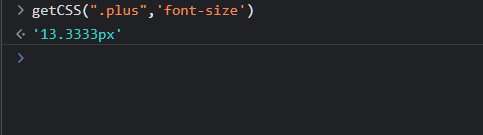
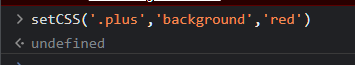
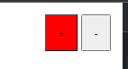

# 유틸리티함수 getCSS / setCSS

<br />

## ✅ 서론

<hr />

- 유틸리티 함수 `getCSS()` / `setCSS()`를 만들어보자

## ✅ getCSS()

<hr />

- `getCSS()`로 해당 스타일요소의 속성들을 출력할 수 있다
- `getComputedStyle`로 해당 노드가 가지고 있는 스타일에 접근할 수 있는데
- 해당 메서드를 이용해 함수를 만들고 예외처리를 구성
- 또한 `예외처리`를 할 수 있는 메서드도 구성하여 재사용할 수 있도록 구현해보자


**에러메시지 함수 구현**
```js
const syntaxError = (message) => {
    throw new SyntaxError(message)
}

```

**getCSS 함수 구현**
```js

const getCSS = (node,prop) => {

    // 첫번째 인수가 문자열, 즉 => '.class','#id', 'h1' 등등으로 들어왔을경우
    if(typeof node === 'string'){
        // 전달받은 문자열에 document.querySelector로 선택
        node = document.querySelector(node)
    }

    if(!node){
        syntaxError("getCSS 함수에서 첫번째 인수는 필수 입니다.")
    }

    //body의 style 내에 prop으로 넣은 속성이 없을 경우를 in문으로 표현
    if(!prop in document.body.style){
        syntaxError("getCSS 함수에서 유효한 CSS 속성이 아닙니다!")
    }

    if(typeof prop !== "string"){
        syntaxError("getCSS 함수에서 prop은 문자형타입으로 구성되어야 합니다")
    }

    return getComputedStyle(node)[prop]
}
 
```



<span style="color:gray"> _getCSS 함수를 사용하여 .plus라는 class를 가진 노드를 선택해서 prop으로 font-size라는 스타일속성을 전달하여 해당 스타일을 조회하는 모습_</span>

<br />
<br />

## ✅ setCSS() 함수 구현

<hr />

-  `setCSS()` 함수는 입력값을 받아 해당 노드의 스타일을 재정의할 수 있다
- 인자로는 `node`,`prop`,`value`값을 받을 수 있는데 해당 인자에 대한 설명으로는,
  - `node` : `node`의 타입이 문자열이면 ➡️ `document.querySelecor(node)`로 선택
  - `prop` :  `prop`이 유효한 스타일속성이라면 해당 스타일속성을 선택(_예시 : `font-size, color 등등`_)
  - `value` : 최종적으로 할당될 값 해당 값이 node와prop으로 선택한 요소에 변화를 부여함 (_예시:"16px" 등등.._)

```js

const setCSS = (node, prop, value) => {
  if (!node) {
    syntaxError("첫번째 인수인 node는 필수입력값입니다");
  }
  if (typeof node === "string") {
    node = document.querySelector(node);
  }
  if (!prop in document.body.style) {
    syntaxError("유효한 CSS 스타일속성이 아닙니다!");
  }

  if (!value) {
    syntaxError("Value값은 필수로 입력해야합니다");
  }

  node.style[prop] = value;
};

```





<span style="color:gray">_setCSS 함수를 이용해 .plus라는 클래스를 가진 속성의 배경에 접근해서 red라는 value로 바꾼 모습_</span>