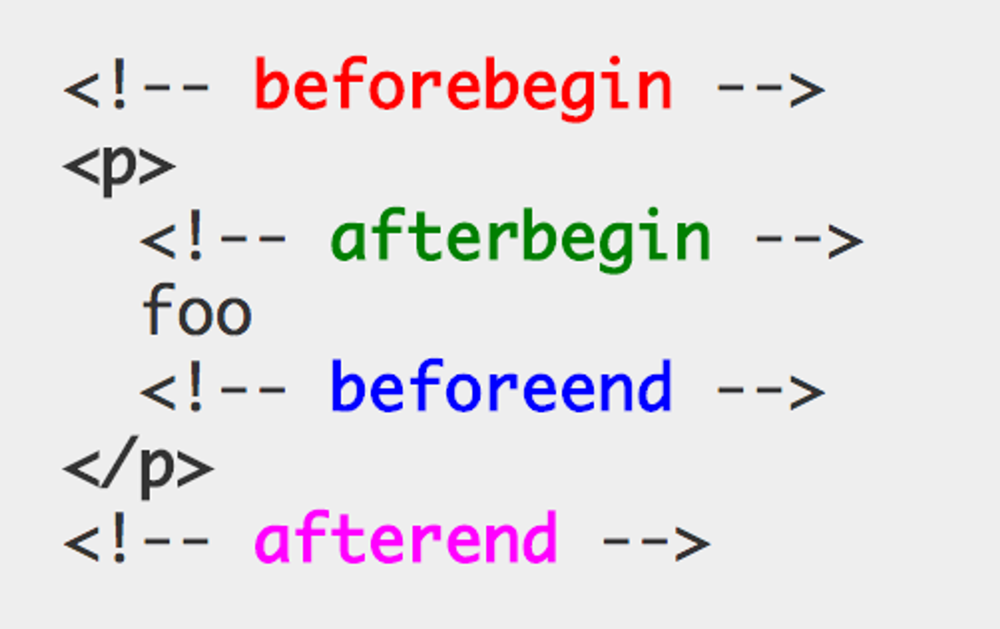

# insertAdjacentHTML 메서드

## insertAdjacentHTML(postion,DOMstring)

**기존 요소를 제거하지 않으면서 위치를 지정해 새로운 요소를 삽입**

- 첫번째 인수(postion)으로 전달할 수 있는 문자열은?

  - ‘beforebegin’
  - ‘afterbegin’
  - ‘beforeend’
  - ‘afterend’

- 두번째 인수로 전달한 HTML 마크업 문자열을 파싱 후 그결과로 생성된 노드를 첫번째 인수로 전달할 위치에 삽입해 DOM에 반영

- 단, `insertAdjacentHTML` 또한 크로스 사이트 스크립팅 공격에 취약하다는 점은 동일
