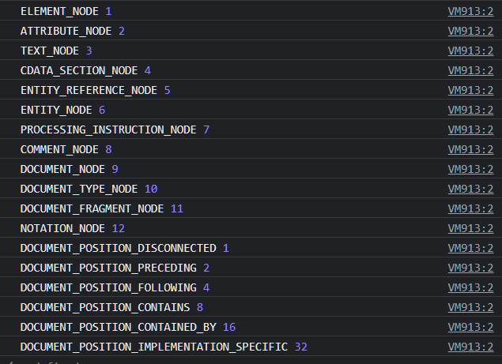

# Node Type

## Node Type 이란?

- 자바스크립트에선 노드의 종류에 따라 정해진 **상수**가 존재한다
- `nodeType`은 `node`의 `type`을 **상수**로 `return`

## Node Type을 전체 출력해보면?

```js
for(var name in Node){
   console.log(name, Node[name]);
}
```

<br />

