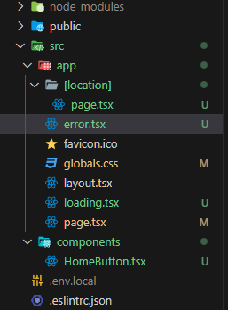

# Nextjs에서 로딩페이지와 에러페이지 정의

## 에러페이지/로딩페이지 적용 방법

**기존 React에서 일일히 ErrorBoundary 등의 fallback으로 지정해줬어야 됬던 방법과 달리 매우 간단하다**

- `app` 디렉토리 내에서 `error.tsx/tsx` 컴포넌트를 정의하기만해도 에러가 발생해도 해당 만들어뒀던 에러페이지로 UI를 보여주게 된다

### 상황 : 현재 API-key가 달라 에러가 나는상황


**에러파일 생성하기**

- app 디렉토리 내부에 error.tsx 파일을 생성한다
- 에러 컴포넌트는 반드시 클라이언트 컴포넌트여야 하므로 파일 최상단에 `use clinet` 사용

```tsx
"use client";

function error() {
  return (
    <>
      <div>error</div>
    </>
  );
}

export default error;
```

### 로딩 페이지 렌더링

**에러 페이지와 마찬가지로 `app` 디렉토리 내부에 `loading.tsx/ts` 파일 생성 시 알아서 로딩시 UI를 화면에 그려준다**


