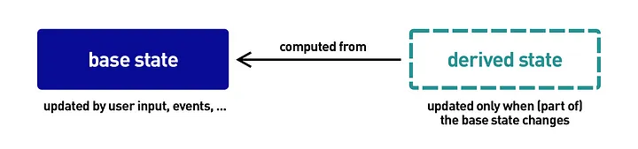

# 파생상태 (Derived State)

## 파생상태란?

**애플리케이션에서 필수적으로 업데이트되지 않고 기본 상태 및/또는 다른 파생 상태 또는 그 일부에서 추론(계산)되는 모든 종류의 상태**

- 컴포넌트에 많은 상태를 가지고 있는것은 코드를 복잡하게 만들며, 디버깅이 어려워질 수 있는 요인이 될 수 있다.
- 하나의 상태를 다양히 핸들링하는 파생상태를 사용하면 상태를 최소화한 컴포넌트를 구성할 수 있다.



```jsx
export const fruitIcon: Record<Fruit, string> = {
  Apple: "🍎",
  Banana: "🍌",
  Kiwi: "🥝"
};

import { useState } from "react";
import "./styles.css";
import { fruits, Fruit, fruitIcon } from "./util";

export const App = () => {
  const [cartItems, setCartItems] = useState<Fruit[]>([]);

  const goToCheckout = () => {
    alert("Proceeding to checkout...");
  };

  return (
    <div className="shop">
      <div className="grid">
        <div>
          <h2>Items</h2>
          <div className="items">
            {fruits.map((fruit, index) => (
              <button
                key={index}
                className="button button-add"
                onClick={() => {
                  setCartItems((prevCartItems) => [...prevCartItems, fruit]);
                }}
              >
                <span className="fruit-icon">{fruitIcon[fruit]}</span> Add to
                cart
              </button>
            ))}
          </div>
        </div>
        <div>
          <h2>Cart</h2>
          <ul className="cart">
            {cartItems.map((cartItem, index) => (
              <li key={index}>{cartItem}</li>
            ))}
          </ul>
        </div>
      </div>
      <button className="button button-checkout" onClick={goToCheckout}>
        Checkout
      </button>
    </div>
  );
};


```

### 위 코드에서 문제점이 존재한다.

- 바로, cartItems이 비었을 때 카트가 비어있음에도 불구하고 결제버튼이 활성화된다.
- 위와 같은 문제점을 파생상태로 간단히 해결할 수 있어진다.

```jsx
export const App = () => {

    const [cartItems, setCartItems] = useState<Fruit[]>([]);
    const isCartEmpty = cartItems.length === 0;

    return (
        ...
        <button
            className="button button-checkout"
            onClick={goToCheckout}
            disabled={isCartEmpty}
        >
            Checkout
        </button>
    );
};

```

- isCartEmpty는 cartItems의 상태에 따라 동적으로 true/false가 변화하는 "파생상태"이다.
  - 따라서 disabled 프로퍼티에 isCartEmpty를 할당하게되면, cartItems가 비었을땐 동적으로 button이 disabled될것이다.
