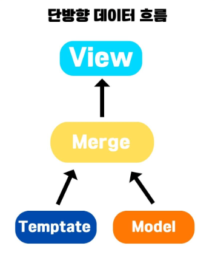

# 리액트에서의 단방향 데이터 바인딩

## 단뱡향 데이터 바인딩이란?

**React의 핵심 개념 중 하나**

- 데이터의 흐름이 한 방향으로만 이루어진다는 개념
- 리액트에서 데이터는 상위 컴포넌트에서 -> 하위컴포넌트로 전달된다.
  - 이를 `Top-Down` 혹은 `Parent to Child` 데이터 흐름이라고 부른다.
- 이러한 특징은 애플리케이션의 복잡성을 줄이고, 코드의 가독성을 향상 시켜준다

 

 

## 상위에서 하위로의 데이터 흐름

- 이는 부모 컴포넌트가 자식 컴포넌트에게 데이터를 전달한다는 의미
- 해당 데이터는 `react`에서는 `props`라는 형태로 전달됨
- 자식 컴포넌트가 해당 `props`를 읽을 수는 있지만 수정할 수는 ❌
  - 이를 통해 데이터가 원본에 어디있는지 쉽게 추적이 가능하여 디버깅과 유지보수에 용이해진다
