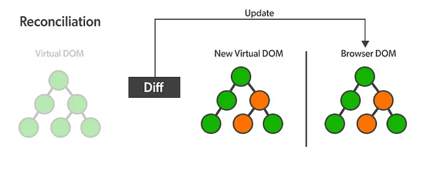

# React에서의 가상돔 (Virutal DOM)

## Virutal DOM 이란?

- 리액트가 많은 개발자들사이에 사랑받는 이유 중 하나는 바로 **빠른속도**이다.
- 이러한 빠른 속도를 구현가능하게 해주는 것 중 하나가 리액트는 가상돔을 사용해 보다 효율적으로 페이지를 브라우저에 빠르게 렌더링해주게된다.

> 그래서 Virtual DOM이 뭔데?

- Virutal DOM은 실제 DOM과 같은 내용을 담고 있는 복사본같은 느낌이다.
- 복사본은 실제 DOM이 아닌 Javascript 객체 형태로 메모리 안에 저장되어 있다
- 가상돔은 실제 DOM의 복사본이기때문에, 실제 DOM의 모든 element와 속성을 공유한다.

## Virtual DOM이 가지고 있는 장점

- 가상 DOM은 실제 DOM과 내용을 공유하는 복사본이나, 실제 DOM과 다르게 직접적으로 브라우저 화면의 UI를 조작해주는 API는 제공하지 않는다.
- 때문에, 가상돔에 접근하고 수정하는 것은 매우 가볍고 빠른 작업이 되는 것이다.
  - 실제 브라우저 접근하는 것이 아니기 때문에!

> 리액트는 항상 두개의 가상돔 객체를 보유

1. 렌더링 이전에 화면 구조를 나타내는 가상돔
2. 렌더링 이후에 보이게 될 화면 구조를 나타내는 가상돔

리액트는 state가 변경될때마다 리렌더링이 발생하는데, 이 시점마다 새로운 내용이 담긴 가상돔을 생성한다.

렌더링 이전에 화면의 내용을 담고 있는 첫번째 가상돔과 리렌더링이 일어나 업데이트된 이후에 발생한 두번째 가상돔을 비교해 정확히 어떤 Element가 변했는지 비교하고 실제 DOM에 UI를 Update하는데, 이를 `Reconciliation(재조정)`이라고 한다.

- 이러한 과정이 매우 효율적인 이유는 변경된 모든 Elelement들을 집단화시켜 이를 한번에 DOM에 적용시키기 때문이다.
  - 만약 리스트 안에 10개의 항목이 바뀌었다면 실제 DOM을 10번 반복해 수정하는 것이아닌, 한번에 집단화 시켜 이를 적용한다는 점이다.
