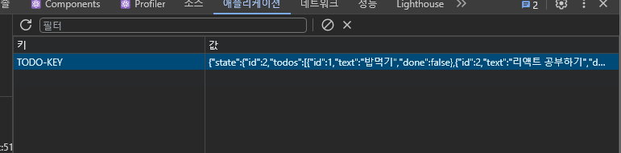

# Persist 미들웨어

## Persist 란?

- `Zustand`엔 `immer` 이외에 `persist`라는 내장 미들웨어가 존재
- `persist` 미들웨어를 통해 상태가 변경된 최신 값을 새로고침시나 브라우저에서 나갈 시에도 로컬스토리지에 값이 저장되 해당 값을 유지할 수 있게된다.

## Persist 사용 방법

- 매우 간단하다. 기존에 정의되어 있는 `create` 함수 내부에 `persist`로 래핑하면 된다.
- 그리고 두번째 인수(객체로이루어짐)로 추가적으로 persist를 구별할 수 있는 고유의 `key`값 `name` 프로퍼티에 넣어줘야 한다.

```tsx
/* persist로 래핑하기 전 */
export const useTodoStore = create<TodoState & TodoAction>((set) => ({
  id: 0,
  todos: [],
  currentInput: "",

  setInput: (input) => set((state) => ({...state, currentInput: input})),
  addTodo: () =>
    set((state) => {
      const newTodo = {
        id: state.id + 1,
        text: state.currentInput,
        done: false,
      };
      return {
        ...state,
        todos: [...state.todos, newTodo],
        currentInput: "",
        id: state.id + 1,
      };
    }),
}));

/* persist로 래핑한 후 고유의 키값 넣어주기 */

export const useTodoStore = create<TodoState & TodoAction>(
  persist(
    (set) => ({
      id: 0,
      todos: [],
      currentInput: "",

      setInput: (input) => set((state) => ({...state, currentInput: input})),
      addTodo: () =>
        set((state) => {
          const newTodo = {
            id: state.id + 1,
            text: state.currentInput,
            done: false,
          };
          return {
            ...state,
            todos: [...state.todos, newTodo],
            currentInput: "",
            id: state.id + 1,
          };
        }),
    }),
    {
      name: "TODO-KEY",
    }
  )
);
```

**persist로 인해 로컬스토리지에 적용된 키-밸류**

