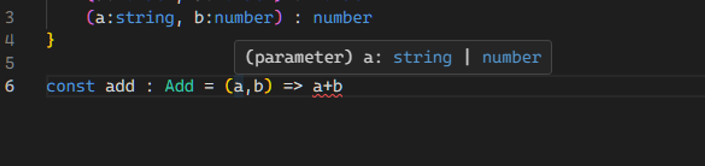

# 함수 오버로딩(Function Overloading)

## 함수 오버로딩이란?

- 하나의 함수가 다양한 매개변수를 지원할 수 있도록 하는 기능
- 함수 오버로딩 사용 시 동일한 함수의 이름을 가진 여러 버전의 함수를 정의할 수 있다.
  - 또한 각각의 버전은 서로 다른 매개변수 형식을 받을 수 있다

<br />

### 함수 오버로딩 예시

**Type 정의**

- 이제 Add타입은 `(a:number, b:number) : number` 모양으로 부를 수도 있고 / `(a:string, b:number) : number` 모양으로도 부를 수 있게 되어진다.

```tsx
/*기존 함수 타입정의*/
type Add2 = (a: number, b: number) => number;

/*함수 오버로딩을 위한 함수타입정의*/
type Add = {
  (a: number, b: number): number;
  (a: string, b: number): number;
};
```


<span style="color:gray">_파라미터 a,b_</span>

**Type 정의2**

- 아래 코드에서 `push` 함수에서 `params` 매개변수의 타입이 `string`일 경우 `path`에 대한 접근이라고 타입 내로잉을 했고 아닐경우 `params`가 객체(=Confing) 타입이라고 타입 내로잉을 했다

```tsx
type Config = {
  path: string;
  state: object;
};

type Push = {
  (path: string): void;
  (config: Config): void;
};

const push: Push = (params) => {
  if (typeof params === "string") console.log(params);
  else {
    console.log(params.path);
  }
};
```
